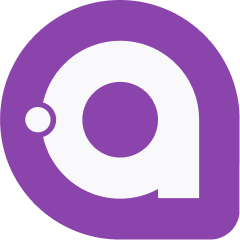

<p align="center">
  
  <h1 align="center">Avalonia Documentation</h1>
</p>

The repository holds the code and markdown source files for the Avalonia documentation website, which is accessible at [docs.avaloniaui.net](https://docs.avaloniaui.net)

## Index
- [Index](#index)
- [Feedback](#feedback)
- [Documentation Issues](#documentation-issues)
- [Contributing](#contributing)
  - [Workflow](#workflow)
  - [Conventions](#conventions)
- [Local setup](#local-setup)
  - [Requirements](#requirements)
  - [Setup](#setup)
  - [Starting](#starting)
- [Thanks 💜](#thanks-)

## Feedback
We welcome your valuable feedback on the documentation! Please feel free to join our [Community on Telegram](https://t.me/Avalonia) and send us a message. We would be delighted to hear from you and assist you with any queries or concerns you may have. 

## Documentation Issues
If you come across any issues with the documentation or have a feature request related explicitly to it, we encourage you to create a new [GitHub issue](https://github.com/AvaloniaUI/avalonia-docs/issues/new). Before creating a new issue, we kindly request that you check for existing issues to avoid duplication. 

## Contributing
To contribute to the Avalonia documentation, you need to fork this repository and submit a pull request for the Markdown and/or image changes that you're proposing.

### Workflow
The two suggested workflows are:

- For small changes, use the "Edit this page" button on each page to edit the Markdown file directly on GitHub.
- If you plan to make significant changes or preview the changes locally, clone the repo to your system to and follow the installation and local development steps in [Local setup](#local-setup).

### Conventions

- The front matter for every markdown file should include an `id`, `title`, `description` and `doc-type`.
  ```yaml
  ---
  id: main-window
  title: Main window
  description: Set and access the main window or main view for desktop, mobile, and browser platforms.
  doc-type: explanation
  ---
  ```

- Use `kebab-case` for file and folder names.
  For example:
  - `/docs/get-started/create-your-first-project.md`
  - `/controls/input/buttons/togglebutton.md`

- When adding an image to the repo, store them in the `img` subfolder inside `static`. Create or identify a folder matching the relevant topic, for example: `static\img\custom-controls\custom-flyout-demo.gif`.
  
  When you link to an image, the path and filename are case-sensitive. The convention is `kebab-case`. `import` should be used to help detect broken images and placed near the top of the document for easier maintenance. Use the `<Image>` component to insert the image inline.

  > Example code for adding an image in markdown file:
  ```markdown
  import LayoutZonesDiagram from '/img/concepts/ui-concepts/layout/layout-zones.png';
  <Image light={LayoutZonesDiagram} maxWidth="400" alignment="center" alt="A diagram with four overlapping rectangles, representing the layout zones of a UI window." />
  ```

## Local setup

### Requirements

- **Node version >= 18**

### Setup

```bash
npm install
```

### Starting

```bash
npx docusaurus start
```

### API Reference Generation

The API reference pages are generated using the `dotnet-apiref` tool and the configuration in `apiref.json`. The generated output is committed to the repository, so CI and other contributors do not need the tool installed to build the site.

#### Running manually

To regenerate API reference content locally, install the `dotnet-apiref` tool and run:

```bash
npm run apiref:materialise
```

This runs `dotnet-apiref materialise --site .`, which reads `apiref.json`, fetches NuGet packages, and writes API documentation files into the site.

#### Automatic regeneration (optional)

If you want API reference content to regenerate automatically before every local `build` or `start`, add these lifecycle hooks to the `scripts` section of `package.json`:

```json
"prestart": "npm run apiref:materialise",
"prebuild": "npm run apiref:materialise"
```

Do not commit these hooks, as CI does not have `dotnet-apiref` installed and the build will fail. The generated API reference files are already committed to the repository.

## Thanks 💜

Thanks for all your contributions and efforts towards improving the Avalonia UI documentation. We thank you being part of our ✨ community ✨!
