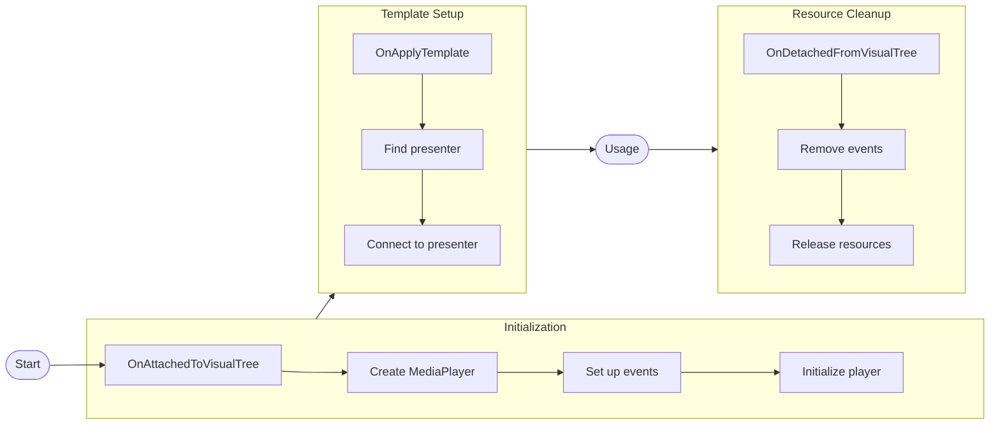
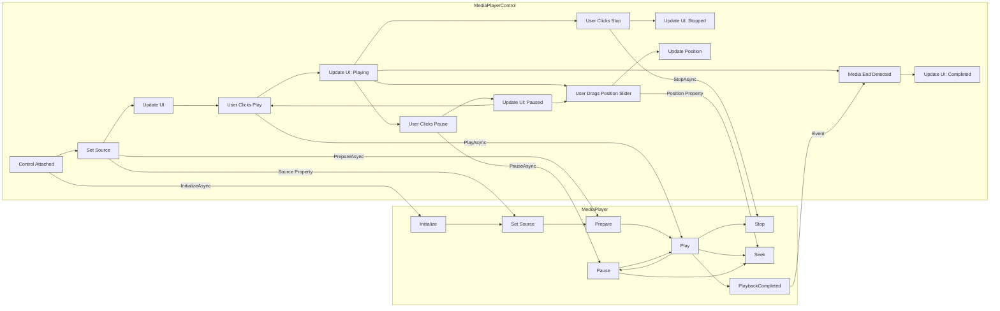

# MediaPlayerControl

The `MediaPlayerControl` is a fully-featured UI control for media playback that provides transport controls, progress
display, volume control, and video rendering. It encapsulates a `MediaPlayer` instance and provides a rich user
interface for media playback.

- [Properties](#properties)
    - [Basic Properties](#basic-properties)
    - [Playback Properties](#playback-properties)
    - [State Properties](#state-properties)
    - [Audio Properties](#audio-properties)
    - [Command Properties](#command-properties)
- [Events](#events)
- [Usage Examples](#usage-examples)
    - [Basic Usage](#basic-usage)
    - [Binding to Commands](#binding-to-commands)
    - [Error Handling](#error-handling)
- [Template Parts and Customization](#template-parts-and-customization)
- [Lifecycle Management](#lifecycle-management)
- [Best Practices](#best-practices)
- [Related Components](#related-components)

## Properties

### Basic Properties

| Property       | Type             | Description                                                                                 |
|----------------|------------------|---------------------------------------------------------------------------------------------|
| Player         | MediaPlayer      | Gets the underlying MediaPlayer instance that handles the actual media playback operations. |
| Source         | MediaSource      | Gets or sets the media source to be played (`UriSource` or `StreamSource`).                 |
| LoadedBehavior | MediaPlayerState | Gets or sets the behavior when media is loaded (`AutoPlay` or `Manual`).                    |

### Playback Properties

| Property                     | Type      | Description                                                                  |
|------------------------------|-----------|------------------------------------------------------------------------------|
| Position                     | TimeSpan  | Gets or sets the current playback position.                                  |
| Duration                     | TimeSpan? | Gets the total duration of the current media. Null for non-seekable media.   |
| <a name="skipTime"/>SkipTime | TimeSpan  | Gets or sets the time to skip with forward/backward commands (default: 10s). |

### State Properties

| Property                | Type    | Description                                                        |
|-------------------------|---------|--------------------------------------------------------------------|
| IsBuffering             | bool    | Gets whether the media is currently buffering.                     |
| BufferProgress          | double? | Gets the buffer progress (0.0-1.0). Null if not available.         |
| IsPaused                | bool    | Gets whether the media playback is currently paused.               |
| IsMediaActive           | bool    | Gets whether media is currently active (loaded and/or playing).    |
| HasVideo                | bool    | Gets whether the current media contains video content.             |
| IsSeekable              | bool    | Gets whether the current media can be seeked.                      |
| IsOverlayTimeoutEnabled | bool    | Gets or sets whether control overlay should hide after inactivity. |

### Audio Properties

| Property | Type   | Description                                                              |
|----------|--------|--------------------------------------------------------------------------|
| Volume   | double | Gets or sets the playback volume with normalized values (e.g., 0.0-1.0). |
| IsMuted  | bool   | Gets whether audio is currently muted.                                   |

### Command Properties

| Property            | Type     | Description                                                           |
|---------------------|----------|-----------------------------------------------------------------------|
| PlayPauseCommand    | ICommand | Gets the command that toggles between play and pause states.          |
| StopCommand         | ICommand | Gets the command that stops playback.                                 |
| MuteCommand         | ICommand | Gets the command that toggles audio muting.                           |
| SkipForwardCommand  | ICommand | Gets the command that skips forward by [SkipTime](#skipTime) amount.  |
| SkipBackwardCommand | ICommand | Gets the command that skips backward by [SkipTime](#skipTime) amount. |

## Events

| Event           | Description                                                  |
|-----------------|--------------------------------------------------------------|
| OnErrorOccurred | Occurs when an error is encountered during media operations. |

## Usage Examples

### Basic Usage

```xaml
<MediaPlayerControl Name="mediaPlayer" Source="{Binding MediaSource}" 
                          Volume="0.8"
                          LoadedBehavior="AutoPlay" />
```

### Binding to Commands

```xaml
<Button Command="{Binding #mediaPlayer.PlayPauseCommand}" 
        Content="Play/Pause" />
        
<Button Command="{Binding #mediaPlayer.StopCommand}" 
        Content="Stop" />
```

### Error Handling

```csharp
mediaPlayer.OnErrorOccurred += (sender, args) =>
{
    Console.WriteLine($"Media error: {args.Message}");
    args.Handled = true; // Prevents the exception from being thrown.
};
```

**Note**: This callback gives you the opportunity to reset the state of the `MediaPlayer` gracefully.

## Template Parts and Customization

The default control template for `MediaPlayerControl` includes several key parts:

- **PART_MediaPlayerPresenter**: Displays the video content
- **MediaControlOverlay**: Contains the playback controls
- **MediaHoverOverlay**: Contains UI elements for hover state

The most basic configuration of the `MediaPlayerControl` can be like this:

```xml
<!-- In a ResourceDictionary referenced by your app. -->
<ControlTheme x:Key="{x:Type MediaPlayerControl}" TargetType="MediaPlayerControl">
  <Setter Property="Template">
    <ControlTemplate>
      <!-- This border is for decoration and for setting a default background for the control 
         When there's no media. -->
      <Border Background="Gray" ClipToBounds="True" CornerRadius="4">
        <Panel>
          <!-- This is used to have a dark background against the MediaPlayerPresenter when there's a 
                 video to be displayed. -->
          <Border IsVisible="{TemplateBinding HasVideo}">
            <Border Background="Black" IsVisible="{TemplateBinding IsMediaActive}"/>
          </Border>

          <!-- This ViewBox is responsible on how the MediaPlayerPresenter is stretched to fit
                 the bounding area of the control. -->
          <Viewbox>
            <!-- The control in which the internal MediaPlayer draws the video -->
            <MediaPlayerPresenter Name="PART_MediaPlayerPresenter"/>
          </Viewbox>

          <!-- Example of the overlay playback controls. 
                 Use the built-in Commands to easily control the playback. -->
          <DockPanel LastChildFill="True" MaxHeight="64" VerticalAlignment="Bottom">
            <ProgressBar DockPanel.Dock="Bottom"
                         IsIndeterminate="True"
                         IsVisible="{TemplateBinding IsBuffering}"/>
            <StackPanel Orientation="Horizontal"
                        HorizontalAlignment="Center"
                        Spacing="10"
                        Margin="5"
                        TextElement.FontSize="24">
              <Button Content="&#x23EF;"
                      Padding="5,-5,5,0"
                      Command="{TemplateBinding PlayPauseCommand}"/>
              <Button Content="&#x23F9;"
                      Padding="5,-5,5,0"
                      Command="{TemplateBinding StopCommand}"/>
            </StackPanel>
          </DockPanel>
        </Panel>
      </Border>
    </ControlTemplate>
  </Setter>
</ControlTheme>
```

You can use that and the default theme as a jumping point for your desired look for `MediaPlayerControl`

## Lifecycle Management

The `MediaPlayerControl` automatically manages the lifecycle of its internal `MediaPlayer`:



Here's a more comprehensive graph of `MediaPlayerControl`'s interactions with `MediaPlayer` over the course of its
lifetime:



## Best Practices

1. **Error Handling**:
    - Always subscribe to the `OnErrorOccurred` event to handle errors gracefully.
    - Set the `Handled` property to true on the `OnErrorOccurred` event handler if you've managed the error.

2. **Resource Management**:
    - The control manages the `MediaPlayer` lifecycle automatically.

3. **UI Integration**:
    - Use the built-in commands for integrating with custom buttons/controls.
    - The `IsMediaActive` property is useful for enabling/disabling UI elements.

## Related Components

- [MediaPlayer](mediaplayer.md)
- [MediaSource](mediasource.md)