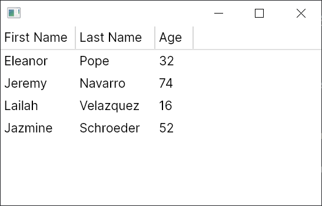

# Flat TreeDataGrid

There are two parts to any `TreeDataGrid`:

- The "Source" which is defined in code and describes how your data model will map to the rows and columns of the `TreeDataGrid`. Here we will be using `FlatTreeDataGridSource`
- The `TreeDataGrid` control which can be instantiated in XAML or from code

If you're using the MVVM pattern then the Source is usually defined at the view model layer, but it can also be defined in code-behind. This introduction will assume that you're using the MVVM pattern.

## The Data Model

The data model is your "source" data that will be displayed in the `TreeDataGrid` and will be specific to your application. For this introduction we will be using a very simple `Person` class:

```csharp
public class Person
{
    public string? FirstName { get; set; }
    public string? LastName { get; set; }
    public int Age { get; set; }
}
```

First we create a `MainWindowViewModel` containing our simple dataset:

```csharp
using System.Collections.ObjectModel;
using Avalonia.Controls;
using Avalonia.Controls.Models.TreeDataGrid;

public class MainWindowViewModel
{
    private ObservableCollection<Person> _people = new()
    {
        new Person { FirstName = "Eleanor", LastName = "Pope", Age = 32 },
        new Person { FirstName = "Jeremy", LastName = "Navarro", Age = 74 },
        new Person { FirstName = "Lailah ", LastName = "Velazquez", Age = 16 },
        new Person { FirstName = "Jazmine", LastName = "Schroeder", Age = 52 },
    };
}
```

We store the data in an [`ObservableCollection<T>`](https://docs.microsoft.com/en-us/dotnet/api/system.collections.objectmodel.observablecollection-1?view=net-6.0) which will allow the `TreeDataGrid` to listen for changes in the data and automatically update the UI.

## The `TreeDataGrid` source

The source defines how to map the data model to rows and columns. Because we're displaying non-hierarchical data, we'll use a `FlatTreeDataGridSource<Person>`. `FlatTreeDataGridSource` is a generic class where the type parameter represents the data model type, in this case `Person`.

The constructor to `FlatTreeDataGridSource` accepts a collection of type `IEnumerable<T>` to which we'll pass our data set. 

We'll create the source in the `MainWindowViewModel` constructor, add three columns, and expose the source in a property:

```csharp
public class MainWindowViewModel
{
    private ObservableCollection<Person> _people = /* defined earlier */

    public MainWindowViewModel()
    {
        Source = new FlatTreeDataGridSource<Person>(_people)
        {
            Columns =
            {
                new TextColumn<Person, string>("First Name", x => x.FirstName),
                new TextColumn<Person, string>("Last Name", x => x.LastName),
                new TextColumn<Person, int>("Age", x => x.Age),
            },
        };
    }

    public FlatTreeDataGridSource<Person> Source { get; }
}
```

The columns above are defined as `TextColumn`s - again, `TextColumn` is a generic class that accepts the data model type and a value type. The first parameter is the header to display in the column and the second parameter is a lambda expression which selects the value to display from the data model.

## The `TreeDataGrid` control

It's now time to add the `TreeDataGrid` control to a window and bind it to the source.

```xml
<Window xmlns="https://github.com/avaloniaui"
        xmlns:x="http://schemas.microsoft.com/winfx/2006/xaml"
        x:Class="AvaloniaApplication.MainWindow">
  <TreeDataGrid Source="{Binding Source}"/>
</Window>
```

## Run the Application

Run the application and you should see the data appear:

