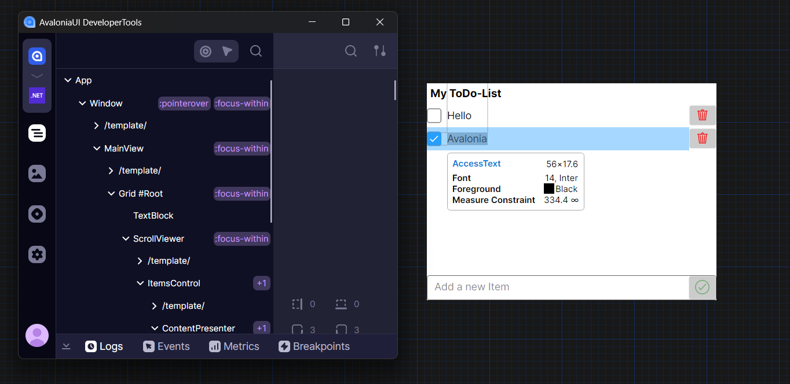

# Attaching to the Previewer

:::warning

Experimental.

:::

[AvaloniaVS](https://marketplace.visualstudio.com/items?itemName=AvaloniaTeam.AvaloniaVS) and [AvaloniaRider](https://plugins.jetbrains.com/plugin/14839-avaloniarider) run previewing window in a full application process, but without real windowing subsystem.

Yet, these extensions are limited in diagnostic features, making it harder to analyze visual trees and actual control placements.

With `Developer Tools` running out-of-process, it is now possible to attach a previewing app to the tool.



## Configuration

Preview extensions don't support any form of keyboard input, making `ConnectOnStartup` the only option at the moment:

```csharp
this.AttachDeveloperTools(o =>
{
    o.ConnectOnStartup |= Design.IsDesignMode;
});
```

By default, `DeveloperToolsOptions.Runner` is disabled in `IsDesignMode`. It was done to avoid unnecessary noise and processes opening each time any XAML file is opened.

Instead, like on the browser or mobile, the `Developer Tools` app should be opened independently.

## Troubleshooting

### Opening `Developer Tools` after the previewing window doesn't work

By default, HTTP connection protocol is configured with `5 seconds` timeout. Which can be a common reason of `ConnectOnStartup` being cancelled, if the tool wasn't opened in time before that.

This behavior can be reconfigured by changing `DeveloperToolsOptions.Protocol`:

```csharp
this.AttachDeveloperTools(o =>
{
    o.Protocol = DeveloperToolsOptions.CreateHttp(connectionTimeOut: TimeSpan.FromMinutes(1));
});
```

### Shortcuts are ignored

As mentioned above, previewer extensions don't listen for keyboard input.
Instead, it's possible to use corresponding action buttons or shortcuts in the `Developer Tools` process itself.

### Developer Tools opens way too many windows

`Developer Tools` opens a tool window per connected process.
If the user has multiple XAML previewer tabs, then multiple tool windows will be opened per each.
