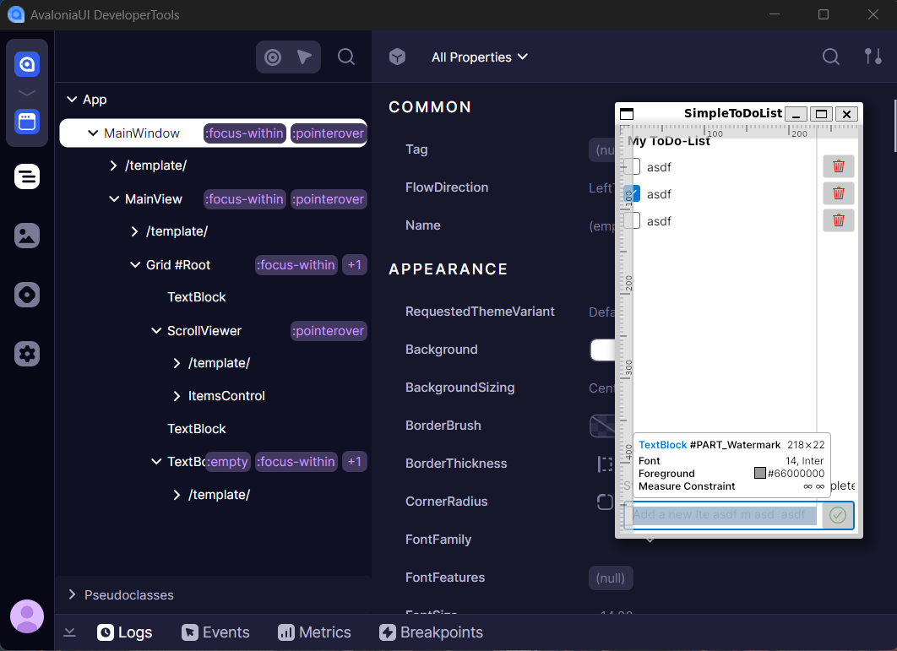

# Attaching WSL2 application

WSL2 is an incredible tool allowing debugging and running of Linux applications from the Windows host.
It's possible to follow the same instructions and install full Developer Tools process in the WSL2 system, potentially duplicating installation with the Windows version.

But for convenience of keeping single installation it is recommended to attach Linux running application to the Windows running Developer Tools instance.

1. Follow [Getting Started](../getting-started.md) instructions for initial setup and nuget packages installation.
2. Configure WSL2 machine once:

    - (Preferred)  Setup WSL2 mirrored mode networking, as specified in [Mirrored mode networking](https://learn.microsoft.com/en-us/windows/wsl/networking#mirrored-mode-networking) documentation. This mode makes Windows `localhost` directly accessible on WSL instance. No extra configuration and code changes is required.

    - (Alternative) Retrieve Windows host IP address following WSL2 documentation: [Accessing Windows networking apps from Linux (host IP)](https://learn.microsoft.com/en-us/windows/wsl/networking#accessing-windows-networking-apps-from-linux-host-ip). Which then can be used in your `AttachDeveloperTools` options:

    ```csharp
    this.AttachDeveloperTools(o =>
    {
        o.Protocol = DeveloperToolsProtocol.CreateHttp(IPAddress.Parse("YOUR_LOCAL_NETWORK_HOST_IP"));
    });
    ```

3. Run `Developer Tools` instance on your Windows host machine. Typically via `avdt` dotnet tool command line.
4. Run your Linux app and attach to `Developer Tools` via F12.


