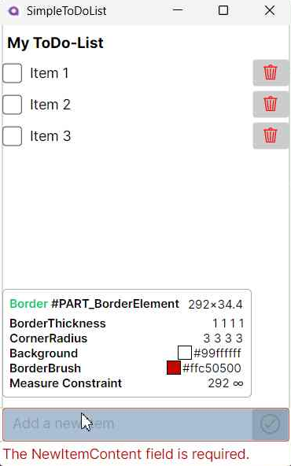

# In-App Overlay

Avalonia Developer Tools provides visual overlays that display directly on your running application, helping you visualize and debug UI components without code modifications.

## Enabling Overlays

You can activate overlays in two ways:

### 1. Via [Elements](./elements.md) Tree

Overlays automatically appear when hovering over elements in the Developer Tools tree.

### 2. Via "Highlight Elements" Mode shortcut

Enter inspect mode directly in your application:
- Press `Ctrl+Shift+H` (Windows/Linux) or `Cmd+Shift+H` (macOS)
- Hover over any element to see its overlay
- If necessary, this mode can be disabled by pressing the same shortcut

## Available Overlays

### Info Tooltip

Displays detailed element information when hovering:

- **Basic Information**: Element type, name, and style classes
- **Layout Properties**: Dimensions, margins, padding, constraints, and Z-Index
- **Visual Properties**: Border and background details, colors and opacity
- **Text Properties**: Foreground color, font settings
- **Control-Specific Properties**: Selection brushes, image details

### Layout Overlay

Visualizes UI structure with color-coded highlights:

- **Margin**: Semi-transparent highlighting of margin space
- **Padding**: Semi-transparent highlighting of padding
- **Bounds**: Solid border around actual control boundaries

### Ruler Overlay

Provides measurement references:

- Horizontal and vertical rulers along window edges
- Guide-lines connecting content boundaries to rulers

