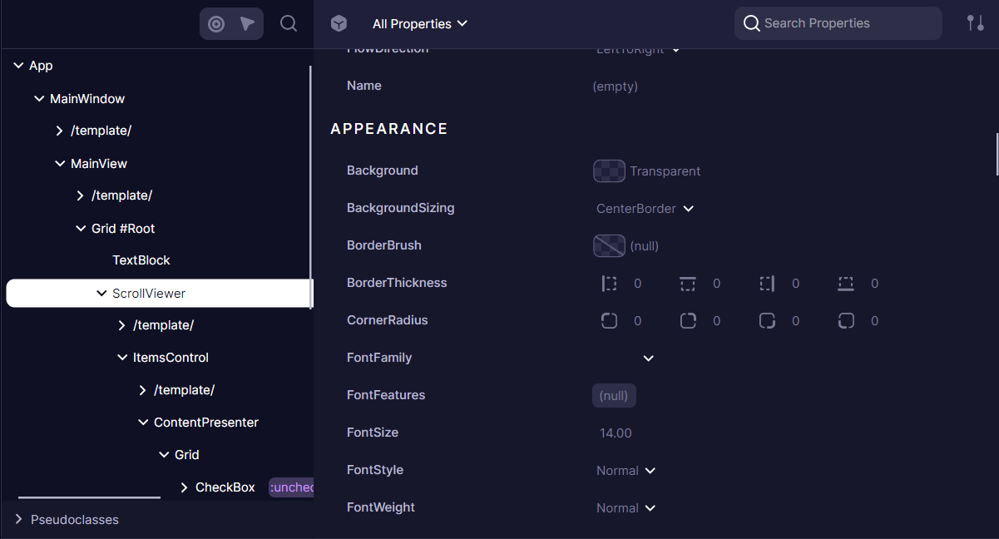
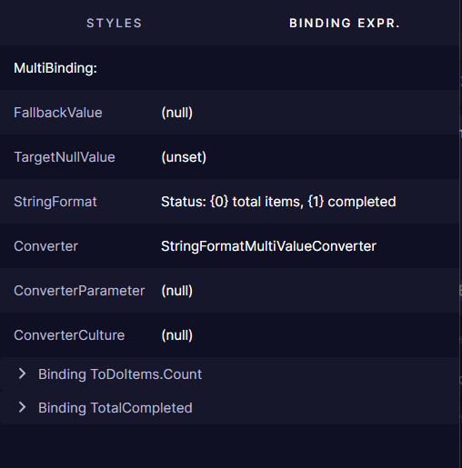

# Element Properties

The Properties panel shows detailed information about the selected element in the [Elements](./elements.md) tree, displaying all properties, styles, and values affecting the element.

The panel displays all Avalonia properties assigned to the element. Developers can:
- Filter properties by name
- Sort properties alphabetically or by value
- Group properties by categories
- Edit values using specialized editors (ColorPicker, BrushPicker, Image/Geometry previews)
- Properties with nested grids are clickable, allowing to preview `DataContext` or `Image.Source`-like properties.

## Property Details

When a developer selects a property, additional details become available through two specialized tabs.

### Styles and values

Avalonia properties operate on a priority-based system where multiple values can be assigned to a single property. The Properties panel reveals this layered approach:

Each property can have multiple setters with different priorities and conditions. For example, a button might have different background colors defined for its normal state, hover state, and pressed state. The DevTools shows all these setters, with the currently active one expanded by default.

Inactive setters (those whose conditions aren't currently met) appear collapsed and grayed-out. This visual hierarchy helps developers understand which style is currently applied and why, making it easier to debug styling issues.

### Binding Expressions

The Binding Expressions tab reveals how properties are connected to data sources:

When a property uses data binding, this tab shows crucial information about the binding relationship:
- Source and Path of the binding
- Validation errors if the binding is failing
- Additional binding parameters like Mode, Converter, and FallbackValue

For properties with validation errors, the panel displays the exception type and message, including any inner exceptions that might provide additional context for debugging.

Some properties use MultiBinding expressions that combine multiple sources:

