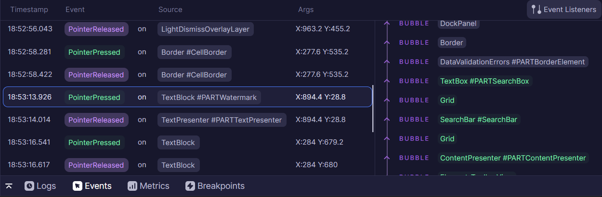
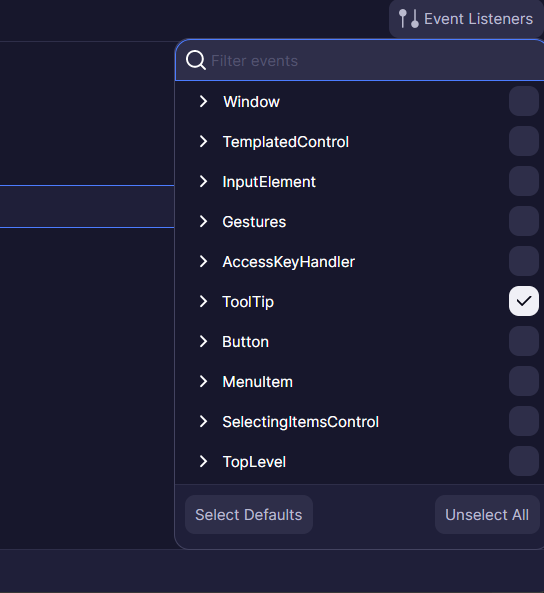
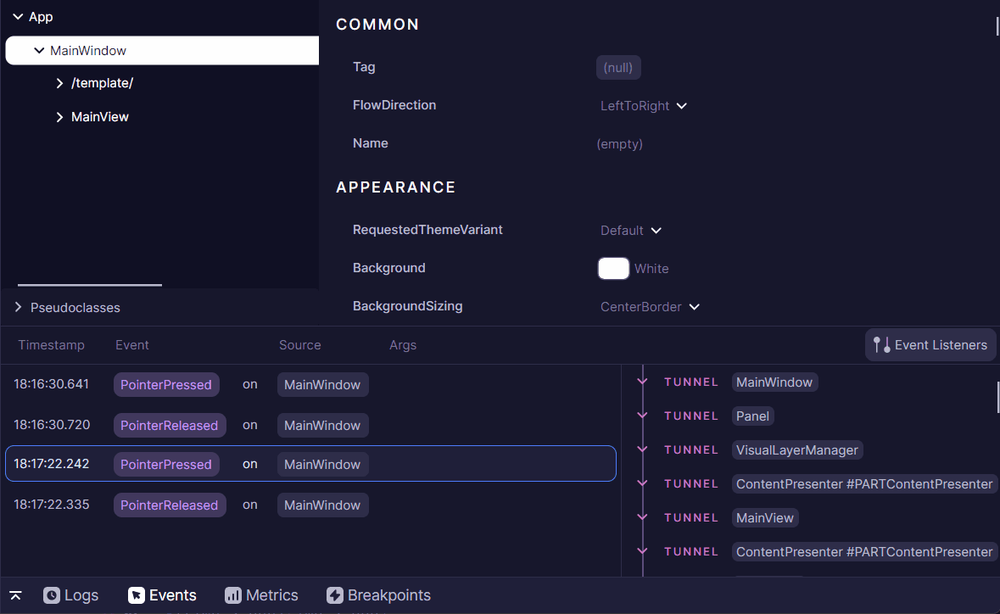

# Application Events Tool

The Events Tool provides real-time monitoring and debugging capabilities for Avalonia's routed event system. Routed events in Avalonia follow a sophisticated event handling mechanism where events can traverse up or down the visual tree. This tool helps developers track event propagation, identify event handlers, and debug event-related issues in their applications.

Visit [Routed Events](https://docs.avaloniaui.net/docs/concepts/input/routed-events) Avalonia documentation for more fundamental information.

## Enabling Event Listeners

By default, `Button.Click`, `KeyDown`, `KeyUp`, `TextInput`, `PointerReleased`, and `PointerPressed` events are enabled. These defaults can be controlled by the `Default Routed Events` setting; see [Developer Tools Settings](../settings.md) page.

Use the "Event Listeners" flyout button to enable or disable any particular routed event or events group.

This list is gathered from statically registered routed events at the time when the tab is first opened.
If an event isn't displayed in this list, it's likely because it was never referenced in the application.

## Navigating List of Event Handlers

In Avalonia, routed events have three possible routing strategies:
- `Tunnel` strategy routes from the root (typically a window) to the source element (typically clicked or focused element).
- `Bubble` strategy is the opposite and routes from the source back to the window.
- `Direct` strategy only occurs when an event is raised directly on the source, without routing to any other element.

`Bubble` is the default strategy used in XAML and C# event handlers. The `Tunnel` strategy is often called `Preview` as it allows handling of events before the standard `Bubble`.

While a single raised event can go through multiple element handlers, only one will actually mark the event as handled, stopping the route.

In `Developer Tools`, all three strategies are color-coded.
The element that has handled the event is visually distinct from the others, indicating the position where the route has stopped.

`Developer Tools` will still show the following element handlers, which could receive already-handled event arguments.

## Inspecting Event Handler Control

Each element handler is clickable, redirecting the user to the corresponding node in the elements tree.

Note: If nothing happens when clicking on an element, it was likely already removed from the elements tree.

