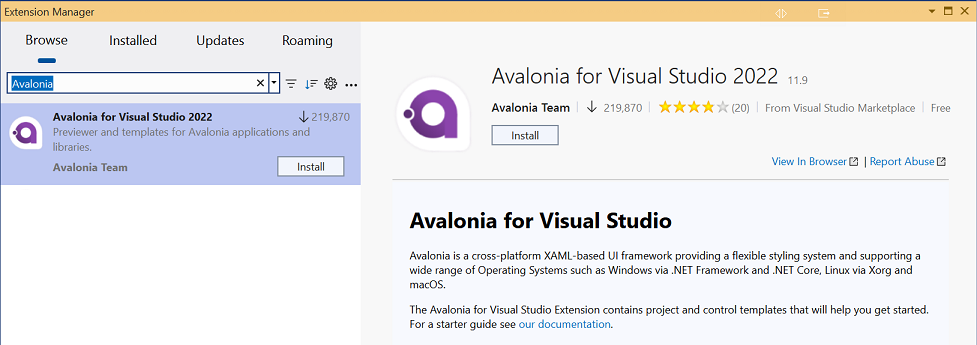
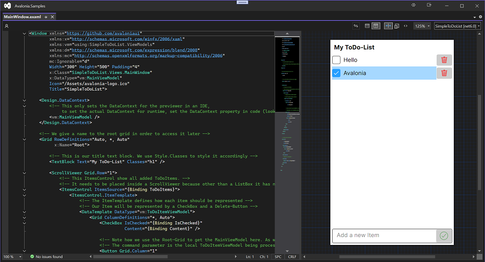

# Avalonia Visual Studio Extension

## Installation

The Avalonia Visual Studio Extension is available from [the Visual Studio Marketplace](https://marketplace.visualstudio.com/items?itemName=AvaloniaTeam.AvaloniaVS)

It supports Visual Studio 2022 version 17.10 and above.

In addition to downloading and installing the extension from the marketplace you can also search within the **Manage Extensions** window on the **Extensions** menu

## Features

The extension provides an enhanced way of working with Avalonia XAML files. It does this by providing:

- An enhanced editor with deep integrations for a rich editing experience.
- A Previewer so you can see what the UI will look like without having to run the application.

### Enhanced Editor

The editor for Avalonia XAML includes the following capabilities:

- Smarter, more helpful Intellisense while typing.
- Error highlighting and fix suggestions.
- Automatic XAML namespace imports.
- Full colorization of the XAML.
- "Go To Definition" navigation.
- Intelligent hover tips.
- Automatic document formatting.
- Outlining of the document so you can collapse elements.

### Previewer

The previewer allows you to see what the UI of the open document will look like without needing to run the application.

The image below shows a window from a sample app open, with the previewer to the right of the source.

## Settings

Multiple [settings are available](./settings.md) to control the editor and previewer.
