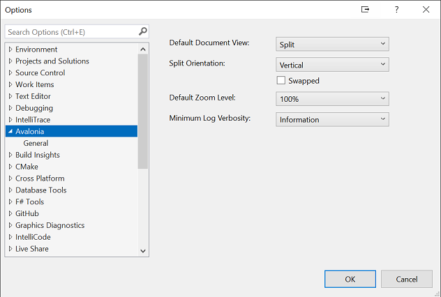

# Avalonia Visual Studio Extension - Settings

Multiple options are provided to allow you to configure the way the editor and previewer behave.

These can be accessed by selecting **Options** from the **Tools** menu inside Visual Studio.

|  Setting              | Description | Options       |
|-----------------------|-------------|---------------|
| Default Document View | What is displayed when a document is opened | Split (Default) - Both the code and the previewer Design - Just the previewer  Source - Just the source code |
| Split Orientation     | Whether to split the orientation horizontally or vertically | Horizontal (Default) - The editor and previewer are displayed side by side Vertical - The editor and previewer are displayed one above the other |
| Swapped               | Whether the default position of the editor and previewer should be inverted when opening a document in 'Split' mode | True if checked |
| Default Zoom level    | How to size the content in the  | 100% (Default) Various percentages Fit to Width - Allow the preview to take the full width of the available space Fit All - Fill the entire previewer |
| Minimum Log Verbosity | The minimum LogLevel for information output by the extension | Trace Debug Information (Default)<>Warning Error Critical None |
