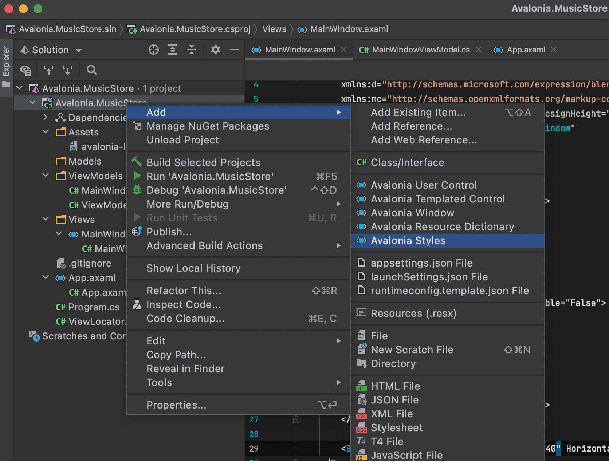

# Add and Layout Controls

The main window of the app will eventually show a list of album covers in the user's collection, with a button at its top-right corner to allow the user to add a new album. The button will open a search dialog window to find new albums to add.&#x20;

On this page you will learn how to layout the main window so that the button appears at its top-right corner, as required.

## Button Layout

To display a button in the content zone of the main window, follow this procedure:

* [ ] Stop the app if it is still running.
* [ ] Locate and open the <mark style="color:green;">**MainWindow.axaml**</mark> file.
* [ ] Inside the panel element, add the following XAML for a button. The panel XAML should look like this:&#x20;

```markup
<Panel>
    <ExperimentalAcrylicBorder IsHitTestVisible="False">
        <ExperimentalAcrylicBorder.Material>
            <ExperimentalAcrylicMaterial
                 BackgroundSource="Digger"
                 TintColor="Black"
                 TintOpacity="1"
                 MaterialOpacity="0.65" />
        </ExperimentalAcrylicBorder.Material>
     </ExperimentalAcrylicBorder>

     <Button Content="Buy Music"/>
</Panel>
```

* [ ] Click <mark style="color:green;">**Debug**</mark> to compile and run the project.


You will see the button, but it is in the default position and not at the top-right of the window as required.

Follow this procedure to position the button correctly:

* [ ] Stop the app if it is still running
* [ ] Wrap the button element in a new panel element.
* [ ] Add a margin attribute to the new panel element, with a value of 40. &#x20;
* [ ] Add horizontal and vertical alignment attributes to the button element, as shown:

```markup
<Panel Margin="40">
  <Button Content="Buy Music" 
     HorizontalAlignment="Right" VerticalAlignment="Top" />
</Panel>
```

You should see all these changes reflected in the preview pane as you add them.&#x20;

## Button Icon

Have a look back at the image of the finished app [here](./). &#x20;

<div style={{textAlign: 'center'}}>
  
</div>

You will see that the button shows an icon, and not text (as it currently does). This is actually the Microsoft Store icon from the Fluent Icons collection, and _Avalonia UI_ has definitions for all these for you to use.

To use the Microsoft Store icon, follow this procedure:&#x20;

* [ ] Navigate to the _Avalonia UI_ _GitHub_ to find the list of Fluent Icons at [https://avaloniaui.github.io/icons.html](https://avaloniaui.github.io/icons.html)
* [ ] Use your browser's text search to locate the name of the icon 'store\_microsoft\_regular'. There should be some code similar to:

```markup
<StreamGeometry x:Key="store_microsoft_regular">M11.5 9.5V13H8V9.5H11.5Z M11.5 17.5V14H8V17.5H11.5Z M16 9.5V13H12.5V9.5H16Z M16 17.5V14H12.5V17.5H16Z M8 6V3.75C8 2.7835 8.7835 2 9.75 2H14.25C15.2165 2 16 2.7835 16 3.75V6H21.25C21.6642 6 22 6.33579 22 6.75V18.25C22 19.7688 20.7688 21 19.25 21H4.75C3.23122 21 2 19.7688 2 18.25V6.75C2 6.33579 2.33579 6 2.75 6H8ZM9.5 3.75V6H14.5V3.75C14.5 3.61193 14.3881 3.5 14.25 3.5H9.75C9.61193 3.5 9.5 3.61193 9.5 3.75ZM3.5 18.25C3.5 18.9404 4.05964 19.5 4.75 19.5H19.25C19.9404 19.5 20.5 18.9404 20.5 18.25V7.5H3.5V18.25Z</StreamGeometry>
```

* [ ] Copy all of the code for the icon.
* [ ] In the _Rider s_olution explorer, right-click the project.
* [ ] Click <mark style="color:green;">**Add**</mark>, then click  <mark style="color:green;">**Avalonia Styles**</mark>



* [ ] Enter the <mark style="color:green;">**Name**</mark> 'Icons', press enter.
* [ ] Locate and open the new <mark style="color:green;">**Icons.axaml**</mark> file that is created. The XAML will look like this:

```markup
<Styles xmlns="https://github.com/avaloniaui"
        xmlns:x="http://schemas.microsoft.com/winfx/2006/xaml">
    <Design.PreviewWith>
        <Border Padding="20">
            <!-- Add Controls for Previewer Here -->
        </Border>
    </Design.PreviewWith>

    <!-- Add Styles Here -->
</Styles>
```

* [ ] Add a new `<Style>` element with start and end tags.
* [ ] Add a new `<Style.Resources>` element with start and end tags inside the new `<Style>` element.
* [ ] Paste your icon code inside the `<Style.Resources>` element.

The icons file now looks like this:

```markup
<Styles xmlns="https://github.com/avaloniaui"
        xmlns:x="http://schemas.microsoft.com/winfx/2006/xaml">
    <Design.PreviewWith>
        <Border Padding="20">
            <!-- Add Controls for Previewer Here -->
        </Border>
    </Design.PreviewWith>

    <!-- Add Styles Here -->
    <Style>
        <Style.Resources>
            <StreamGeometry x:Key="store_microsoft_regular">M11.5 9.5V13H8V9.5H11.5Z M11.5 17.5V14H8V17.5H11.5Z M16 9.5V13H12.5V9.5H16Z M16 17.5V14H12.5V17.5H16Z M8 6V3.75C8 2.7835 8.7835 2 9.75 2H14.25C15.2165 2 16 2.7835 16 3.75V6H21.25C21.6642 6 22 6.33579 22 6.75V18.25C22 19.7688 20.7688 21 19.25 21H4.75C3.23122 21 2 19.7688 2 18.25V6.75C2 6.33579 2.33579 6 2.75 6H8ZM9.5 3.75V6H14.5V3.75C14.5 3.61193 14.3881 3.5 14.25 3.5H9.75C9.61193 3.5 9.5 3.61193 9.5 3.75ZM3.5 18.25C3.5 18.9404 4.05964 19.5 4.75 19.5H19.25C19.9404 19.5 20.5 18.9404 20.5 18.25V7.5H3.5V18.25Z</StreamGeometry>
        </Style.Resources>
    </Style>
</Styles>
```

With a new icons file prepared, you must now include it in your app.

Follow this procedure to include the icons file:

* [ ] Locate and open the <mark style="color:green;">**App.axaml**</mark> file.
* [ ] Add a `<StyleInclude>` element as shown:

```markup
<Application.Styles>
    <FluentTheme Mode="Dark"/>
    <StyleInclude Source="avares://Avalonia.MusicStore/Icons.axaml" />
</Application.Styles>
```

You need to build the application so that the icons become available to the preview pane.

To change the button from text to icon content, follow this procedure:

* [ ] Locate and open the <mark style="color:green;">**MainWindow.axaml**</mark> file.
* [ ] Alter the XAML for the button, as shown:

```markup
<Button HorizontalAlignment="Right" VerticalAlignment="Top">       
    <PathIcon Data="{StaticResource store_microsoft_regular}" /> 
</Button>
```

* [ ] Click <mark style="color:green;">**Debug**</mark> to compile and run the project.


On the next page, you will learn how to link the button in the view (of the MVVM pattern) to a command in the view model, so it can act on the application logic there.
