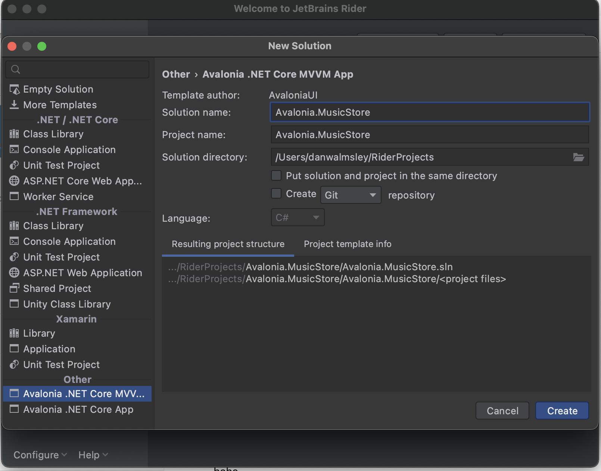
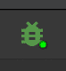
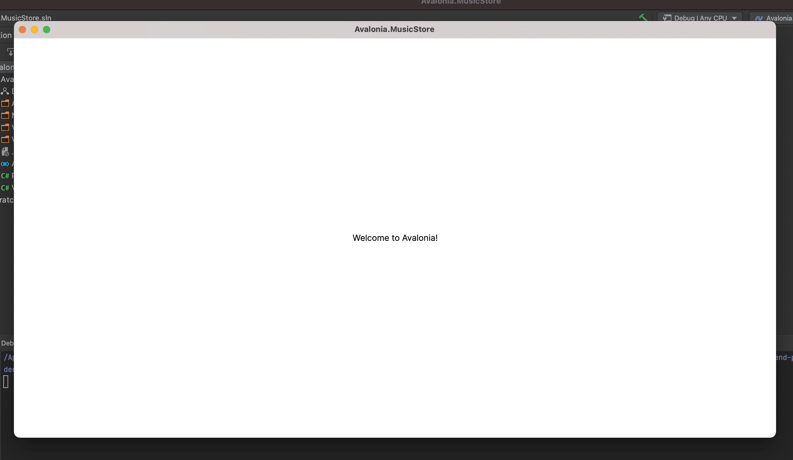

# Create a New Project

On this page you will lean how to create a new project for the app.

### JetBrains Rider 

Before you start, check you have installed the _Avalonia UI_ solution templates for _JetBrains Rider_.


For full instructions on preparing _JetBrains Rider_ for developing with _Avalonia UI_, see [here](../../reference/jetbrains-rider-ide/jetbrains-rider-setup.md).


With the solution templates installed, begin this tutorial by following these instructions:

* [ ] On the **Welcome to JetBrains Rider**</mark> screen, click <mark style="color:green;">**New Solution**.
* [ ] From the project types list on the left, locate and click **Avalonia .NET Core MVVM App**</mark>. It will be under the section <mark style="color:green;">**Other**.
* [ ] Leave the **MVVM Toolkit** option as (the default) _ReactiveUI_ framework.
* [ ] Enter the **Solution name** as 'Avalonia.MusicStore'.
* [ ] Click **Create**.

  

A new project will be created with the following solution folders and files:

  

Take some time to review the files and folders that the solution template created. You will see that the following the MVVM pattern, these folders were created:

<table><thead><tr><th width="188">Folder Name</th><th>Description</th></tr></thead><tbody><tr><td>Assets</td><td>Contains any embedded assets that are compiled into the program. <code>Images</code>, <code>Icons</code>, <code>Fonts</code> etc, anything that the UI might need to display,</td></tr><tr><td>Models</td><td>This is an empty folder for code that is the 'model' part of the MVVM pattern. This often contains everything else the app needs that is not part of the UI. For example: interaction with a database, Web API, or  interfaces with a hardware device. </td></tr><tr><td>View Models</td><td>This is a folder for all the view models in the project, and it already contains an example. View models contain the application logic in the MVVM pattern. For example: a button is enabled only when the user has typed something; or open a dialog when the user clicks here; or show an error if the user enters too high a number type of logic in this input.</td></tr><tr><td>Views</td><td>This is a folder for all the views in the project, and it already contains the view for the application main window. Views in the MVVM pattern contain only the presentation for the application; that is layout and form, fonts, colors, icons and images. In MVVM they have only enough code to link them to the view model layer. In <em>Avalonia UI</em> there is only enough code to manage windows and dialogs here.</td></tr></tbody></table>


To explore the concepts behind the MVVM pattern, and when is appropriate to use it, see [here](../../concepts/the-mvvm-pattern/).


The solution template has created enough files for the application to run. You will meet all of these during the rest of this tutorial.   &#x20;

## Run the Project 

Press the debug button top-right of the IDE to compile and run the project.

This will show a window that looks like:

It is a little plain - but you now have a running application, and a blank canvas to start developing with. On the next page you will learn how to add a modern-looking acrylic blur dark background.&#x20;
