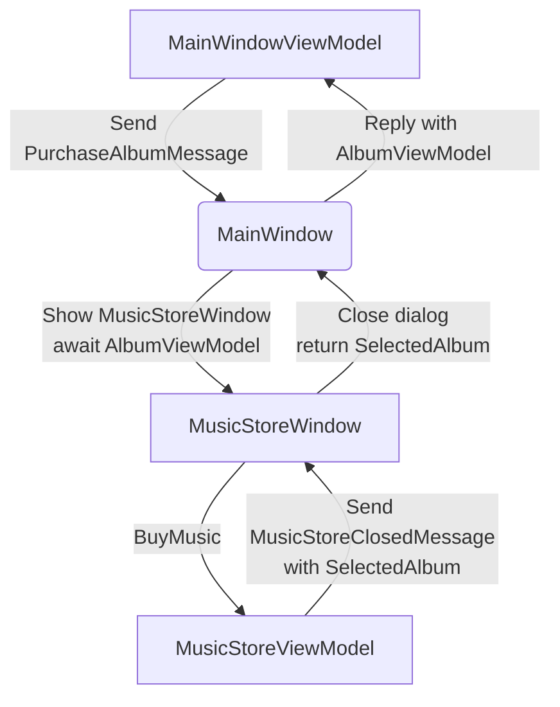

import MusicStoreAddWindowScreenshot from '/img/tutorials/music-store-app/opening-a-dialog/add-window.png';
import MusicStoreDialogOpenedScreenshot from '/img/tutorials/music-store-app/opening-a-dialog/dialog-opened.png';

# Open a Dialog

On this page you will learn how to open dialog window in your app and exchange data between windows using Mvvm.Messaging. The dialog will be used to search for and select an album to add to a list in the main window.

Two messages will be used in your app:
- **PurchaseAlbumMessage** — sent by the main view model to request the dialog window be shown and await a result.
- **MusicStoreClosedMessage** — sent by the dialog's view model when the user selects an album, to return the result and close the dialog.

Below is a diagram showing the message flow between the components that you are going to implement in the next steps:



## Add a New Dialog Window

There is nothing special about a window view file that makes it into a dialog; that is up to the way in which the window is controlled by the app. You will use Avalonia UI features and _CommunityToolkit.Mvvm_ to manage this. So the first step is to create a new window for the app.

To create a new window, follow this procedure:

- Stop the app if it is still running.
- In the solution explorer, right-click the **/Views** folder and then click **Add**.
- Click **Avalonia Window**.
- When prompted for the name, type 'MusicStoreWindow'
- Press enter.

<p></p>

## Dialog Window Styling

To style the new dialog window so that it matches the main window, follow this procedure:

- Locate and open the **MusicStoreWindow.axaml** file.
- Change this code as follows to add the acrylic blur background, extended into the title bar (as before) as shown:

```xml
<Window xmlns="https://github.com/avaloniaui"
        xmlns:x="http://schemas.microsoft.com/winfx/2006/xaml"
        xmlns:d="http://schemas.microsoft.com/expression/blend/2008"
        xmlns:mc="http://schemas.openxmlformats.org/markup-compatibility/2006"
        mc:Ignorable="d" d:DesignWidth="800" d:DesignHeight="450"
        x:Class="Avalonia.MusicStore.Views.MusicStoreWindow"
        Title="MusicStoreWindow"
        TransparencyLevelHint="AcrylicBlur"
        ExtendClientAreaToDecorationsHint="True">
    <Panel>
        <ExperimentalAcrylicBorder IsHitTestVisible="False">
            <ExperimentalAcrylicBorder.Material>
                <ExperimentalAcrylicMaterial
                    BackgroundSource="Digger"
                    TintColor="Black"
                    TintOpacity="1"
                    MaterialOpacity="0.65" />
            </ExperimentalAcrylicBorder.Material>
        </ExperimentalAcrylicBorder>

        <Panel Margin="40">

        </Panel>
    </Panel>
</Window>
```

## Dialog Input and Output

The application logic for the dialog will be controlled by its own view model. This will be created and linked to the dialog window view whenever the dialog is to be shown.

Similarly, the result of the users interaction with the dialog will eventually have to be passed back to the application logic for the main window for processing.

At this stage you will create two empty view model classes to act as placeholders for the dialog view model, and the dialog return (selected album) object. To create these view models, follow this procedure:

- In the solution explorer, right-click the **/ViewModels** folder and then click **Add**.
- Click **Class**.
- Name the class 'MusicStoreViewModel' and click **Add**.
- Right-click again the **/ViewModels** folder and then click **Add** a second time.
- Click **Class**.
- Name the class 'AlbumViewModel' and click **Add**.

## Show Dialog

Now that you have a new window `MusicStoreWindow` and the corresponding view models `MusicStoreViewModel` and `AlbumViewModel`.
You are going to complete the logic so that:

* The main window view model sends a message requesting the dialog to be shown.
* The main window view receives that message, opens the dialog, and returns the result.

Below is how this works step-by-step using the CommunityToolkit.Mvvm messaging API.

### Define the PurchaseAlbumMessage
- In the project root directory create new folder **/Messages** 
- Into newly created **/Messages** folder add a class **PurchaseAlbumMessage.cs**.

First, you are going to define a message class called `PurchaseAlbumMessage` that carries an `AlbumViewModel` response. 
This message will be sent by the view model when it needs to show the dialog.

- Open **PurchaseAlbumMessage.cs** and add the following code there:

```csharp
using Avalonia.MusicStore.ViewModels;
using CommunityToolkit.Mvvm.Messaging.Messages;

namespace Avalonia.MusicStore.Messages;

public class PurchaseAlbumMessage : AsyncRequestMessage<AlbumViewModel?>;

```
_`AsyncRequestMessage<T>`_ lets you send a request and await a reply of type T (in our case, AlbumViewModel?).

### Register the Message Handler in  MainWindow
In _MainWindow.axaml.cs_ register a handler for `PurchaseAlbumMessage`. This handler runs whenever the view model sends that message. Its job is to:

- Create the dialog window.
- Assign `MusicStoreViewModel` as its DataContext.
- Call `ShowDialog<AlbumViewModel?>` and pass the result back via m.Reply(...).

Open _MainWindow.axaml.cs_ and add the following code into MainWindow constructor:
```csharp
        public MainWindow()
        {
            InitializeComponent();

            if (Design.IsDesignMode)
                return;
            
            // Whenever any code will call 'Send(new PurchaseAlbumMessage())', invoke this callback on the MainWindow instance:
            WeakReferenceMessenger.Default.Register<MainWindow, PurchaseAlbumMessage>(this, static (w, m) =>
            {
                // Create an instance of MusicStoreWindow and set MusicStoreViewModel as its DataContext.
                var dialog = new MusicStoreWindow
                {
                    DataContext = new MusicStoreViewModel()
                };
            // Show dialog window and reply with returned AlbumViewModel or null when dialog will get closed
                m.Reply(dialog.ShowDialog<AlbumViewModel?>(w));
            });
        }
```
### Send the Message from the ViewModel
Now, update the AddAlbumAsync() inside MainWindowViewModel to send the PurchaseAlbumMessage when the user clicks on the store button.
- Open MainWindowViewModel.cs
- Locate AddAlbumAsync() RelayCommand that we added in the previous steps.
- Edit AddAlbumAsync() as shown:
```csharp
[RelayCommand]
private async Task AddAlbumAsync()
{
    // Send the message to the previously registered handler and await the selected album
    var album = await WeakReferenceMessenger.Default.Send(new PurchaseAlbumMessage());
}
```
Now:
- Click **Debug** to compile and run the project.
- Click the icon button.

It all works - but the dialog window opens at the same size as the main window, and offset from it.

## Dialog Position and Size

In the last step here, you will make the dialog smaller that the main window, and open centered on it. You will also make the main window open in the center of the user's screen.

Follow this procedure:

- Stop the app if it is still running.
- Locate and open the **MainWindow.axaml** file.
- Add an attribute to the `<Window>` element to set the start-up position:

```xml
<Window ...
    WindowStartupLocation="CenterScreen">
```

- Locate and open the **MusicStoreWindow.axaml** file.
- Add attributes for the width and height of the dialog, set at 1000 and 550 respectively.
- Add the start-up position attribute set to `CenterOwner`, as shown:

```xml
<Window ...
    Width="1000" Height="550"
    WindowStartupLocation="CenterOwner">
```

- Click **Debug** to compile and run the project.
- Click the icon button.

<p></p>

The dialog window is now opened centered inside the main window.

On the next page, you will learn how to add some content to the dialog window to represent a search for albums, and present the results.
