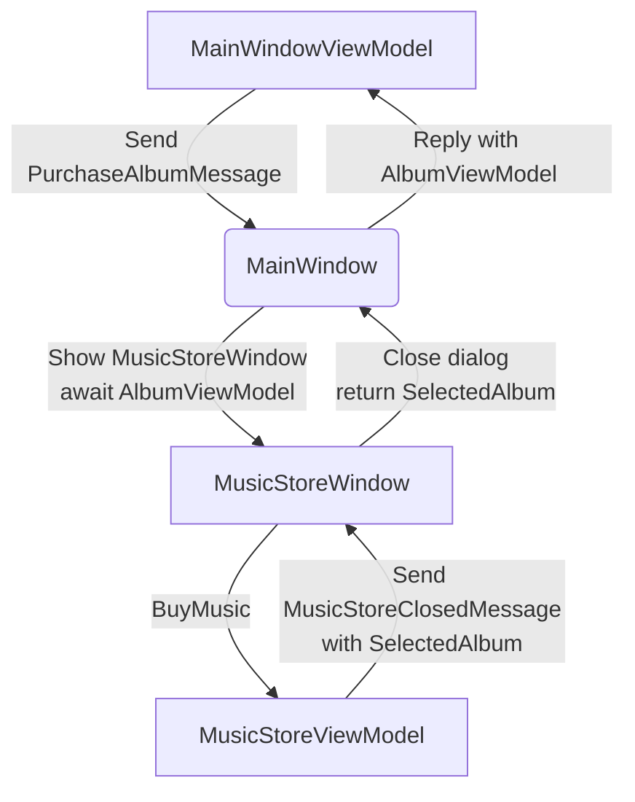

import MusicStoreAddWindowScreenshot from '/img/tutorials/music-store-app/opening-a-dialog/add-window.png';
import MusicStoreDialogOpenedScreenshot from '/img/tutorials/music-store-app/opening-a-dialog/dialog-opened.png';

# 打开对话框

在本页中，您将学习如何在应用程序中打开一个对话框窗口，并使用 Mvvm.Messaging在窗口之间交换数据。该对话框将用于搜索和选择一个专辑，以添加到主窗口的专辑列表中。

你的应用将使用两种消息：

- **PurchaseAlbumMessage** —— 由主视图模型发送，请求显示对话框并等待结果。
- **MusicStoreClosedMessage** —— 由对话框视图模型在用户选择专辑后发送，用于返回结果并关闭对话框。

下方是一个图示，展示了你将在接下来的步骤中实现的组件之间的消息流：



## 添加一个新的对话框窗口

一个窗口文件本身没有什么特殊之处使其成为对话框，这完全取决于应用如何控制它。你将使用 Avalonia UI 的特性和 *CommunityToolkit.Mvvm* 来管理这个窗口。因此第一步是为应用创建一个新窗口。

要创建一个新窗口，请按照以下步骤进行操作：

- 如果应用程序仍在运行，请停止它。
- 在解决方案资源管理器中，右键单击 **/Views** 文件夹，然后点击 **添加**。
- 点击 **Avalonia Window**。
- 在提示输入名称时，输入 'MusicStoreWindow'。
- 按下回车键。

<p></p>

## 对话框窗口样式

要将新的对话框窗口样式与主窗口相匹配，请按照以下步骤进行操作：

- 找到并打开 **MusicStoreWindow.axaml** 文件。
- 如下更改代码，以添加亚克力模糊背景，并将其延伸到标题栏中（与之前相同）：

```xml
<Window xmlns="https://github.com/avaloniaui"
        xmlns:x="http://schemas.microsoft.com/winfx/2006/xaml"
        xmlns:d="http://schemas.microsoft.com/expression/blend/2008"
        xmlns:mc="http://schemas.openxmlformats.org/markup-compatibility/2006"
        mc:Ignorable="d" d:DesignWidth="800" d:DesignHeight="450"
        x:Class="Avalonia.MusicStore.Views.MusicStoreWindow"
        Title="MusicStoreWindow"
        TransparencyLevelHint="AcrylicBlur"
        ExtendClientAreaToDecorationsHint="True">
    <Panel>
        <ExperimentalAcrylicBorder IsHitTestVisible="False">
            <ExperimentalAcrylicBorder.Material>
                <ExperimentalAcrylicMaterial
                    BackgroundSource="Digger"
                    TintColor="Black"
                    TintOpacity="1"
                    MaterialOpacity="0.65" />
            </ExperimentalAcrylicBorder.Material>
        </ExperimentalAcrylicBorder>

        <Panel Margin="40">

        </Panel>
    </Panel>
</Window>
```

## 对话框的输入与输出

对话框的应用程序逻辑将由其自己的视图模型控制。每当对话框显示时，都将创建视图模型并链接到对话框窗口视图上。

类似地，用户与对话框的交互结果最终必须传递回主窗口的应用程序逻辑进行处理。

在这个阶段，您将创建两个空的视图模型类，作为对话框视图模型和对话框返回（选择的专辑）对象的占位符。按照以下步骤创建这些视图模型：

- 在解决方案资源管理器中，右键单击 **/ViewModels** 文件夹，然后点击 **添加**。
- 点击 **类**。
- 将类命名为 'MusicStoreViewModel'，然后点击 **添加**。
- 再次右键单击 **/ViewModels** 文件夹，然后点击 **添加**。
- 点击 **类**。
- 将类命名为 'AlbumViewModel'，然后点击 **添加**。

## 显示对话框

现在你已有了新窗口`MusicStoreWindow`，以及对应的视图模型 `MusicStoreViewModel` 和 `AlbumViewModel`。

* 主窗口视图模型发送请求显示对话框的消息。
* 主窗口视图接收该消息，打开对话框，并返回结果。

下面是使用 CommunityToolkit.Mvvm 的消息 API 实现这些步骤的方式：
### 定义 PurchaseAlbumMessage
- 在项目根目录下新建文件夹 **/Messages** 
- 在新建的 **/Messages** 文件夹中添加类 **PurchaseAlbumMessage**.

首先你将定义一个消息类 `PurchaseAlbumMessage`，它携带一个 `AlbumViewModel` 类型的响应。
该消息将由视图模型在需要显示对话框时发送。

- 打开 **PurchaseAlbumMessage.cs** 并添加如下代码：

```csharp
using Avalonia.MusicStore.ViewModels;
using CommunityToolkit.Mvvm.Messaging.Messages;

namespace Avalonia.MusicStore.Messages;

public class PurchaseAlbumMessage : AsyncRequestMessage<AlbumViewModel?>;

```
_`AsyncRequestMessage<T>`_ 允许你发送一个请求，并等待类型为 T 的响应（此处我们用的是 `AlbumViewModel?`）。

### 在 MainWindow 注册消息处理器
在 _MainWindow.axaml.cs_ 中注册一个处理器来处理 PurchaseAlbumMessage。该处理器会在收到消息时执行，其作用如下：

- 创建对话框窗口。
- 设置 `MusicStoreViewModel` 为其 DataContext。
- 调用 `ShowDialog<AlbumViewModel?>` 并通过 m.Reply(...) 返回结果。

打开 _MainWindow.axaml.cs_，并在构造函数中添加如下代码：
```csharp
        public MainWindow()
        {
            InitializeComponent();

            if (Design.IsDesignMode)
                return;
            
            // Whenever 'Send(new PurchaseAlbumMessage())' is called, invoke this callback on the MainWindow instance:
            WeakReferenceMessenger.Default.Register<MainWindow, PurchaseAlbumMessage>(this, static (w, m) =>
            {
                // Create an instance of MusicStoreWindow and set MusicStoreViewModel as its DataContext.
                var dialog = new MusicStoreWindow
                {
                    DataContext = new MusicStoreViewModel()
                };
                // Show dialog window and reply with returned AlbumViewModel or null when the dialog is closed.
                m.Reply(dialog.ShowDialog<AlbumViewModel?>(w));
            });
        }
```
### 从视图模型中发送消息
现在更新 `MainWindowViewModel` 中的 `AddAlbumAsync()` 方法，在用户点击按钮时发送 `PurchaseAlbumMessage`。
- 打开 **MainWindowViewModel.cs**
- 找到之前添加的`AddAlbumAsync()` 方法。
- 修改`AddAlbumAsync()`如下：
```csharp
[RelayCommand]
private async Task AddAlbumAsync()
{
    // Send the message to the previously registered handler and await the selected album
    var album = await WeakReferenceMessenger.Default.Send(new PurchaseAlbumMessage());
}
```
现在：
- 点击 **Debug **编译并运行项目。
- 点击图标按钮。
一切正常 —— 但对话框窗口大小与主窗口一样，并且位置略微偏移。


## 对话框位置和大小

在这最后一步中，您将缩小对话框使对话框比主窗口更小一些，并居中打开。您还将使主窗口在用户屏幕居中打开。

按照以下步骤进行操作：

- 如果应用程序仍在运行，请停止它。
- 找到并打开 **MainWindow.axaml** 文件。
- 在 `<Window>` 元素中添加一个属性来设置启动位置：

```xml
<Window ...
    WindowStartupLocation="CenterScreen">
```

- 找到并打开 **MusicStoreWindow.axaml** 文件。
- 添加对话框的宽度和高度属性，分别设置为 1000 和 550。
- 添加启动位置属性，设置为 `CenterOwner`，如下所示：

```xml
<Window ...
    Width="1000" Height="550"
    WindowStartupLocation="CenterOwner">
```

- 点击 **调试** 以编译和运行项目。
- 点击图标按钮。

<p></p>

现在对话框窗口在主窗口内居中打开。

在下一页中，您将学习如何向对话框窗口添加一些内容，以表示对专辑的搜索，并呈现结果。
