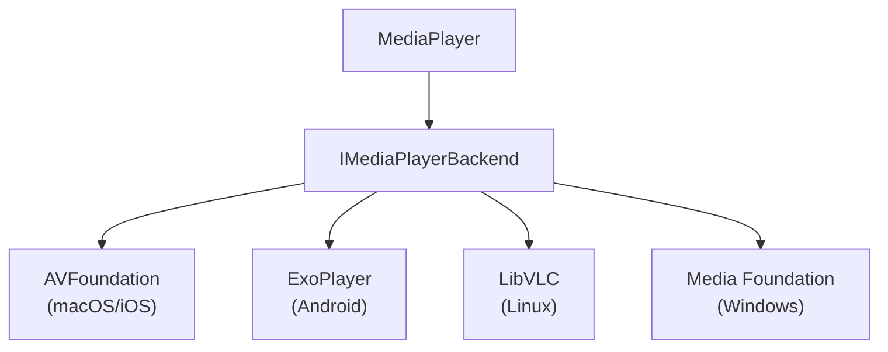

import Pill from '/src/components/global/Pill';

<Pill variant="primary" href="/tools">Accelerate</Pill>
<br/><br/>

The `MediaPlayer` class provides the core functionality for media playback in Avalonia applications. It handles media
loading, playback control, and platform-specific backend management, serving as the engine behind
the `MediaPlayerControl`.

## Properties

### Media Source Properties

| Property | Type        | Description                                                                 |
|----------|-------------|-----------------------------------------------------------------------------|
| Source   | MediaSource | Gets or sets the media source to be played (`UriSource` or `StreamSource`). |

### Playback Properties

| Property       | Type                      | Description                                                        |
|----------------|---------------------------|--------------------------------------------------------------------|
| Position       | TimeSpan                  | Gets or sets the current playback position.                        |
| Duration       | TimeSpan?                 | Gets the total duration of the media. Null for non-seekable media. |
| LoadedBehavior | MediaPlayerLoadedBehavior | Gets or sets playback behavior when media is loaded.               |

### State Properties

| Property         | Type    | Description                                            |
|------------------|---------|--------------------------------------------------------|
| IsSeekable       | bool    | Gets whether the current media supports seeking.       |
| IsBuffering      | bool    | Gets whether the media is currently buffering.         |
| BufferProgress   | double? | Gets buffer progress (0.0-1.0). Null if not available. |
| HasVideo         | bool    | Gets whether the current media contains video content. |
| LastErrorMessage | string  | Gets the most recent error message in error state.     |

### Audio Properties

| Property | Type   | Description                                 |
|----------|--------|---------------------------------------------|
| Volume   | double | Gets or sets the playback volume (0.0-1.0). |
| IsMuted  | bool   | Gets or sets whether audio is muted.        |

### Advanced Properties

| Property        | Type            | Description                                        |
|-----------------|-----------------|----------------------------------------------------|
| Statistics      | MediaStatistics | Gets playback statistics information if available. |
| ForceVlcBackend | bool (static)   | Forces the use of VLC backend (debugging only).    |

## Events

| Event                  | Description                                           |
|------------------------|-------------------------------------------------------|
| NaturalSizeChanged     | Occurs when the natural size of the video changes.    |
| MediaPrepared          | Occurs when the media has been prepared and is ready. |
| MediaStarted           | Occurs when media playback has started.               |
| MediaPaused            | Occurs when media playback has been paused.           |
| MediaStopped           | Occurs when media playback has been stopped.          |
| MediaPlaybackCompleted | Occurs when media playback has completed.             |
| ErrorOccurred        | Occurs when an error is encountered.                  |
| PropertyChanged        | Standard INotifyPropertyChanged event.                |

## Methods

| Method            | Return Type | Description                                   |
|-------------------|-------------|-----------------------------------------------|
| InitializeAsync() | Task        | Initializes the media player and its backend. |
| PrepareAsync()    | Task        | Prepares the media for playback.              |
| PlayAsync()       | Task        | Starts or resumes media playback.             |
| PauseAsync()      | Task        | Pauses media playback.                        |
| StopAsync()       | Task        | Stops media playback.                         |
| ReleaseAsync()    | Task        | Releases resources for the current media.     |
| UnInitialize()    | Task        | Releases all resources used by the player.    |

## Backend Architecture

The `MediaPlayer` uses a pluggable backend architecture to support different platforms:

The backend selection is automatic based on the platform:



## Usage Examples

### Basic Playback

```csharp
// Create and initialize
var player = new MediaPlayer();
await player.InitializeAsync();

// Configure
player.Volume = 0.8;
player.LoadedBehavior = MediaPlayerLoadedBehavior.Manual;

// Load and play media
player.Source = new UriSource("https://example.com/audio.mp3");
await player.PrepareAsync();
await player.PlayAsync();
```

### Using a Custom Visual

You can attach a custom visual target:

```xaml
<Window xmlns="https://github.com/avaloniaui"
        Width="800" Height="450">
    
    <Grid RowDefinitions="*, Auto">
        <Viewbox VerticalAlignment="Stretch" HorizontalAlignment="Stretch">
            <MediaPlayerPresenter Name="presenter" />
        </Viewbox>
    </Grid>
    
</Window>
```

```csharp
private MediaPlayer _player = new MediaPlayer();

protected async override void OnLoaded(EventArgs e)
{
    base.OnLoaded(e);

    await _player.InitializeAsync();

    _player.UpdateTargetVisual(presenter);
    _player.NaturalSizeChanged += Player_NaturalSizeChanged;
}

private void Player_NaturalSizeChanged(object? sender, NaturalSizeChangedEventArgs e)
{
    UpdatePlayerSize(e.NewSize ?? default);
}

private void UpdatePlayerSize(Size size)
{
    var elemVisual = ElementComposition.GetElementChildVisual(presenter);
    var compositor = elemVisual?.Compositor;

    if (compositor is null || elemVisual is null)
    {
        return;
    }

    elemVisual.Size = new Vector(size.Width, size.Height);
    (presenter as MediaPlayerPresenter)?.SetNaturalSize(size);
    presenter.InvalidateMeasure();
}
```
`MediaPlayerPresenter` is provided for convenience, but you can use any custom visual. Ensure that you update the visual with the size provided by the `MediaPlayer` instance.


### Event Handling

```csharp
// Setup event handlers
player.MediaPrepared += (s, e) => Console.WriteLine("Ready to play");
player.MediaStarted += (s, e) => Console.WriteLine("Playback started");
player.MediaPlaybackCompleted += (s, e) => Console.WriteLine("Playback completed");

// Error handling
player.ErrorOccurred += (s, e) => {
    Console.WriteLine($"Error: {e.ErrorMessage}");
};
```

### Resource Cleanup

```csharp
// Clean up when done
await player.StopAsync();
await player.ReleaseAsync();
await player.UnInitialize();
```

## Error Handling

The MediaPlayer uses an event-based approach to error handling:

- When an error occurs, the player transitions to an Error state internally
- The `ErrorOccurred` event is raised with detailed error information
- Most methods check for the Error state and will not proceed
- Call ReleaseAsync() to reset the error state

```csharp
// Subscribe to error events
player.ErrorOccurred += (sender, args) =>
{
    // Handle the error appropriately here with your custom logic.
    // Reset with ReleaseAsync() elsewhere if you need to playback again.
    // ...
    Console.WriteLine($"Error: {args.Message}");
};

// Try to play media
try {
    await player.PlayAsync();
}
catch (Exception ex) {
    // Fallback exception handling if needed
    if (player.LastErrorMessage != null) {
        Console.WriteLine($"Error: {player.LastErrorMessage}");
        
        // Optionally reset the player
        await player.ReleaseAsync();
    }
}
```

## Best Practices

1. **Initialization and Cleanup**:
    - Always call `InitializeAsync()` before using `MediaPlayer`.
    - Call `ReleaseAsync()` between loading different media sources.
    - Call `UnInitialize()` when completely done with `MediaPlayer`.

2. **Error Handling**:
    - Subscribe to the `ErrorOccurred` event to handle playback errors.

3. **Resource Management**:
    - Properly clean up to avoid resource leaks.
    - Consider reusing a single `MediaPlayer` instance for multiple media items that are to be played sequentially.

4. **Platform Considerations**:
    - Test media playback on all target platforms.

## See also

- [MediaPlayer control](/controls/media/mediaplayercontrol)
- [MediaSource class](/reference/classes/mediasource)
- [Implementing MediaPlayer](/docs/media/media-playback)
- [Installing Avalonia Accelerate](/docs/development-optimization/accelerate-tools/installing-accelerate)
- [Troubleshooting](/troubleshooting/controls/mediaplayer)