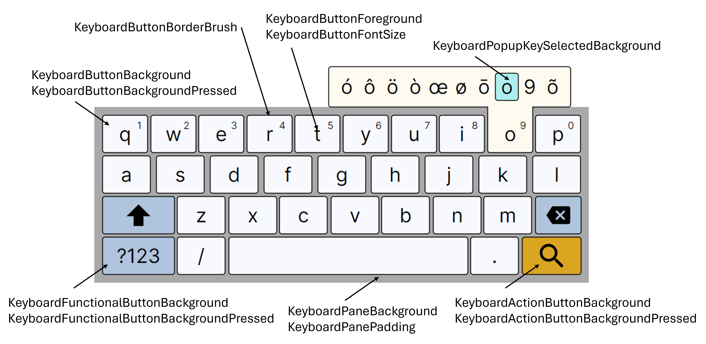

# Virtual Keyboard Styling

The `VirtualKeyboard` control in Avalonia supports custom styling via named resources. You can override these resources in your application to customize the appearance of keyboard elements.

## Customizable Resources



Below is a list of key resources you can override in your theme or resource dictionary:

| Key | Type | Default | Notes |
|---|---|---|---|
| `KeyboardActionButtonBackground` | Brush | `Goldenrod` | 
| `KeyboardActionButtonBackgroundPressed` | Brush | `PaleGoldenrod` | 
| `KeyboardButtonBackground` | Brush | `GhostWhite` | 
| `KeyboardButtonBackgroundPressed` | Brush | `FloralWhite` | 
| `KeyboardButtonBorderBrush` | Brush | `Black` | 
| `KeyboardButtonFontSize` | Double | `24` | introduced in 11.3.1 |
| `KeyboardButtonForeground` | Brush | `Black` | 
| `KeyboardFunctionalButtonBackground` | Brush | `LightSteelBlue` | 
| `KeyboardFunctionalButtonBackgroundPressed` | Brush | `LightBlue` | 
| `KeyboardPaneBackground` | Brush | `DarkGray` | 
| `KeyboardPanePadding` | Thickness |  `4` |
| `KeyboardPopupKeySelectedBackground` | Brush | `PaleTurquoise` | 


## How to Override

To customize, define these resources in your application theme or resource dictionary. For example:

```xml
<SolidColorBrush x:Key="KeyboardButtonForeground" Color="#FF0000" />
```

## Example: Custom Theme

```xml
<ResourceDictionary>
  <SolidColorBrush x:Key="KeyboardPaneBackground" Color="#FFD700" />
  <system:Double x:Key="KeyboardButtonFontSize">36</system:Double>
  <!-- Add more overrides as needed -->
</ResourceDictionary>
```

## See Also
- [VirtualKeyboard](virtual-keyboard.md)
- [Quick Start](getting-started.md)
