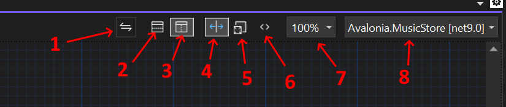

# Avalonia Visual Studio Extension - Previewer

The previewer (on the right in this image) allows you to see what the UI will look like without having to run the app.

At the top of the previewer is a menu with the following options that control what is shown.

1. **Swap Preview and XAML panes** Only visible when both panes are shown.
2. **Horizontal Layout** Display the Previewer and XAML panes stretched horizontally, one above the other.
3. **Vertical Layout** Display the Previewer and XAML panes side by side.
4. **Split View** Show both the XAML and Previewer panes.
5. **Design View**  Show only the Previewer pane.
6. **XAML View** Show only the XAML pane.
7. **Zoom Level** Adjust zooming in and out of the preview. Holding `Ctrl` and using the mouse wheel will also adjust this.
8. **Targets** Select from the available targets. (If the app has more than one.)

The default values of [settings can also be configured for when new windows are opened](./settings.md).
