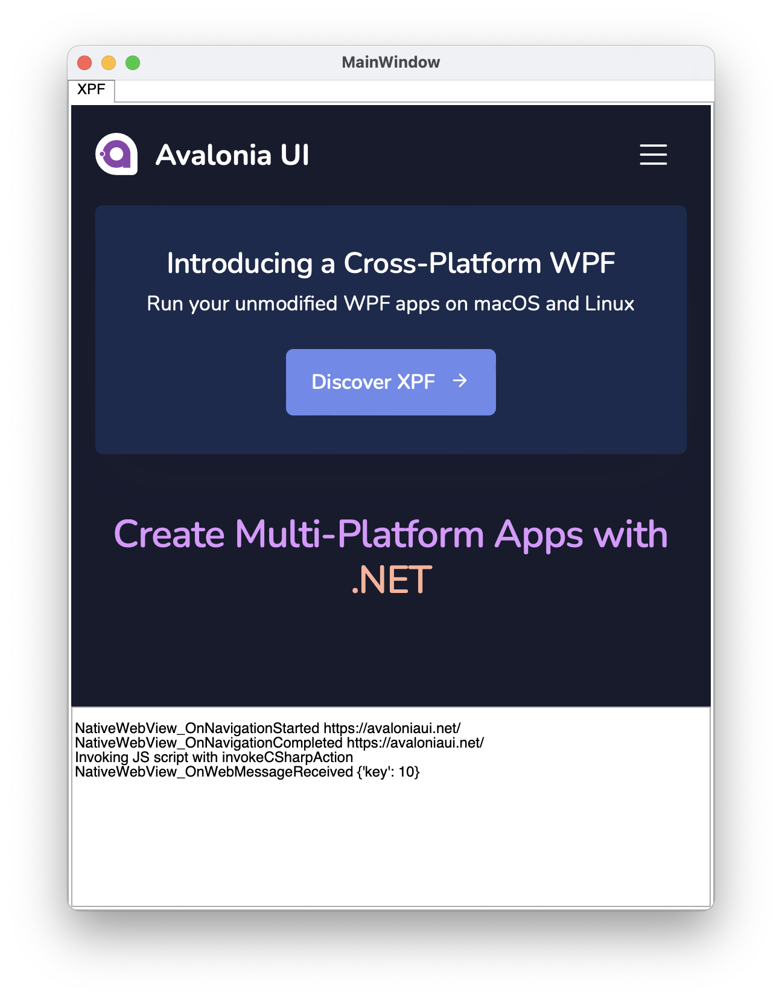

## Overview

Windows provides several controls to embed native WebView inside of the application.
The same controls can't be supported in cross platform environment, as these browsers are usually tied to a Windows.

XPF provides an optional control that abstracts over `WebView2` on Windows and `WKWebView` on macOS. Native browsers that don't require any heavy dependencies like Chromium.

:::note
Since Linux doesn't have any standardized built-in native browser, this platform is not currently supported.
:::

## Installing AvaloniaUI.WebView.Wpf package

First of all, make sure you have installed XPF nuget feed as per [instruction](../build-feeds.md).

With nuget feed working, install `AvaloniaUI.WebView.Wpf` package:
```xml
<PackageReference Include="AvaloniaUI.WebView.Wpf" Version="1.0.999-cibuild0000025-alpha" />
```

:::note
Please use latest version if available. You can check newer versions in the IDE NuGet Packages window.
On Windows, when WebView2 is not available, legacy Internet Explorer is embedded. It's useful when targeting older Windows versions.
:::

## Using NativeWebView control

Add `xmlns:wpf="clr-namespace:AvaloniaUI.WebView;assembly=AvaloniaUI.WebView.Wpf"` xmlns to your XAML file.

Typical usage of the NativeWebView looks like this:
```xml
<wpf:NativeWebView Source="https://avaloniaui.net/" />
```

Where `Source` is a bindable property.

## Handling navigation events

`NativeWebView` supports two navigation events:
- `NavigationStarted` is raised when web page navigation was started. You can read the request Uri from `WebViewNavigationStartingEventArgs.Request`. And it's possible to cancel navigation via `WebViewNavigationStartingEventArgs.Cancel` property. This event also handles redirects.
- `NavigationCompleted` is raised when web page navigation has completed. And `WebViewNavigationCompletedEventArgs` provides `Request` as well as `IsSuccess` properties.

## Bi-directional JavaScript execution

In some situations it's necessary to execute arbitrary JavaScript code from the web view control.
`NativeWebView` provides `InvokeScript` async method:
```csharp
webView.InvokeScript("console.log('Hello World')");
```

When it's required to receive a data from the JavaScript (web page) and process it on the C# side, you can use `NativeWebView.WebMessageReceived` event combined with `invokeCSharpAction` helper JS method.

Complete bi-directional example looks like this:
```csharp
private async void NativeWebView_OnNavigationCompleted(object? sender, WebViewNavigationCompletedEventArgs e)
{
    await ((NativeWebView)sender!).InvokeScript(""" invokeCSharpAction("{'key': 10}") """);
}

private void NativeWebView_OnWebMessageReceived(object? sender, WebMessageReceivedEventArgs e)
{
    var message = e.Body;
    // message == "{'key': 10}"
}
```



## Using with native WPF

To streamline code migration, it's also possible to use `NativeWebView` control with native WPF on Windows. Without XPF involving.

In this scenario, all the API members and underlying browsers are the same. As well as steps to install, the same package can be used.

## Platform compatibility:

| Feature        |  Windows WebView2-Edge | Windows IE (fallback) | macOS WKWebView | Linux |
|---------------|-------|-------|-------|-------|
| `NativeWebView` | ✔ | ✔ | ✔ | ✖ |
| `Source` | ✔ | ✔ | ✔ | ✖ |
| `NavigationStarted` | ✔ | ✔ | ✔ | ✖ |
| `NavigationCompleted` | ✔ | ✔ | ✔ | ✖ |
| `WebMessageReceived` | ✔ | ✖ | ✔ | ✖ |
| `InvokeScript` | ✔ | ✖ | ✔ | ✖ |
