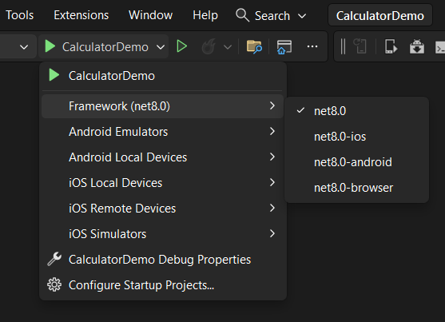
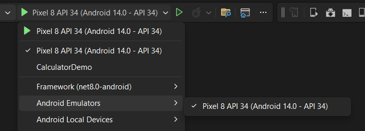
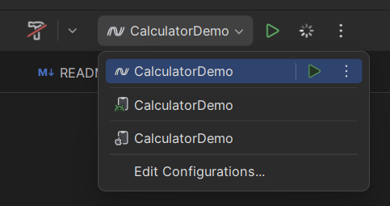
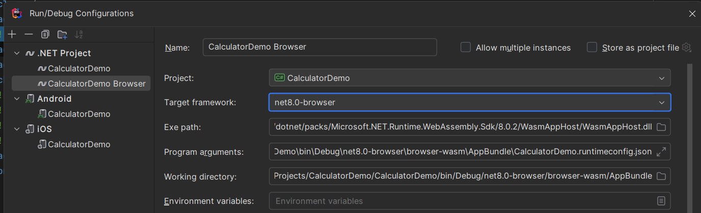
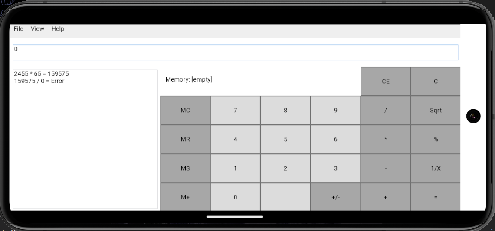

:::danger
XPF support for Mobile and Browser targets is in private-preview. 
:::

:::tip
In this sample we use screenshots from [CalculatorDemo repository](https://github.com/AvaloniaUIOU/CalculatorDemo/tree/mobile-browser). Please ask our support team to give you access to this repository, if you need.
:::

## Before we start

Make sure that your project runs on XPF for Desktop, as well as completing configuration for XPF SDK.

Also, before converting your project, it's necessary to prepare your dev machine.
These steps are shared for any .NET mobile and browser project, so please visit our Avalonia documentation to view these steps:
- [How To Set Up an Android Dev Environment](https://docs.avaloniaui.net/docs/guides/platforms/android/setting-up-your-developer-environment-for-android)
- [How To Set Up an iOS Dev Environment](https://docs.avaloniaui.net/docs/guides/platforms/ios/setting-up-your-developer-environment-for-ios)
- [How To Set Up Browser Dev Environment](https://docs.avaloniaui.net/docs/guides/platforms/how-to-use-web-assembly)

## Multi-targeting

Mobile support in .NET SDK in general is powered by mobile workloads and mobile Target Frameworks.
For desktop applications we normally only use `net8.0` or `net8.0-windows`, which also works on Linux and macOS thank to XPF SDK compatibility layer.

But in order to support Android, iOS or Browser, target project needs to have corresponding Target Frameworks used - `net8.0-android`, `net8.0-ios` and `net8.0-browser`.

If you are familiar with Avalonia XPlat templates, you might know that we recommend creating separated projects per each target.
It's not necessary in XPF projects. Futhermore, it might break WPF embedded resources system, as WPF assumes executable project to be the main project with all resources.

In this tutorial we will continue with a multi-targeting approach by changing:

```diff
-        <TargetFramework>net8.0-windows</TargetFramework>
+        <TargetFrameworks>net8.0;net8.0-ios;net8.0-android;net8.0-browser</TargetFrameworks>
```

Where `net8.0` will be reused for all desktop platforms.
Additionally, to support multi-targeting in XPF SDK you need to add:

```diff
+        <XpfSingleProject>true</XpfSingleProject>
```

## Defining entry point

Unlikely Desktop apps, we don't have a proper Main method for Mobile and Browser.
For Browser, web page itself is an entry point. While on Android, there must be a root Activity.

At the same time, WPF still needs to start with an Application.Run().
So, let's define a shared entry point in Application class, which then will be reused by each platform:

```diff
    public partial class App : Application
    {
+        /// Shared App entry point.
+        public static int Start()
+        {
+            var app = new App();
+            app.InitializeComponent();
+
+            // Note, this method returns early on Mobile and Browser.
+            return app.Run();
        }
    }
```

## Platform specific folders

The last step before we can build the project is to define platform specific folders with entrypoints.

After this step your project structure is expected to look like following:

```
- MyApp
-- Platforms
--- Android
--- Browser
--- Desktop
--- iOS
-- App.xaml (App.xaml.cs)
-- MyApp.csproj
```

We don't provide any templates yet, but you can download pre-created projects from [here](https://github.com/AvaloniaUIOU/SingleProjectPlatforms/archive/refs/heads/main.zip).

Explanation of each file in each folder:

### Desktop

- Program.cs - a familiar entry point file for desktop application.

### Android

- MainActivity - is an entry point of any Android project.
- AndroidManifest.xml - android manifest file, responsible for defining any metadata and permissions your project might require.

### iOS

- AppDelegate.cs - is an entry point of any iOS project.
- Info.plist - iOS/Apple manifest file, responsible for defining any metadata and permissions your project might require.

### Browser

- Program.cs - C# entry point of Browser project.
- wwwroot - a real entry point of a web app, including `index.html` and `main.js`.

Each of this entry points already has a call to `App.Start()` method we defined in a previous step.

## Building

At this point, you should be able to build and compile project.

### .NET CLI

You can build all platform from the command line:

```bash
dotnet build
```

Or for a specific platform:

```bash
dotnet build -f net8.0-android
```

Or running:

```bash
dotnet run -f net8.0-browser
```

:::note
.NET doesn't officially support running Android or iOS apps from .NET CLI directly.
:::

### Visual Studio

While not cross-platform, Visual Studio IDE still is capable of building and running some of these platforms (iOS not supported on Windows).
By default, Visual Studio will target desktop target framework `net8.0`, so "Debug" button will run this.
You can select another platform in Visual Studio dropdown menu below


If Android is targeted, Visual Studio will show selector of emulators or connected devices:



After specific target was selected, Visual Studio will run an emulator or a web page with the app.

### Rider

On Rider it's very similar to a Visual Studio, except it's missing Browser target by default.



In order to add Browser target, you need to click on "Edit Configurations..." in the same dropdown, and add new ".NET Project" configuration, selecting correct "Target framework" field.

All the rest fields will be automatically updated by Rider to match Browser environment.



### VS Code

We don't have a tutorial for a VS Code, but it was confirmed to work with [C# Dev Kit](https://marketplace.visualstudio.com/items?itemName=ms-dotnettools.csdevkit) and [.NET MAUI](https://marketplace.visualstudio.com/items?itemName=ms-dotnettools.dotnet-maui) extensions at least for mobile.

:::note
Generally speaking, Apple doesn't allow emulators/simulators of iOS/iPad devices on non-macOS dev machines. The same goes about not allowing connecting Apple mobile device to Windows. This is why we recommend using macOS for Apple targets. But you can experiment with [Visual Studio macOS pairing feature](https://learn.microsoft.com/en-us/dotnet/maui/ios/pair-to-mac?view=net-maui-8.0).
:::

### WPF Calculator Demo on Android emulator



## Publishing

It's highly recommended to always use .NET CLI for publishing apps:

```bash
# Will output "apk" file in "/bin/Release/net8.0-android/publish" folder.
dotnet publish -f net8.0-android
# Will output "ipa" file in "/bin/Release/net8.0-ios/publish" folder.
dotnet publish -f net8.0-ios
# Will output app bundle folder in "\bin\Release\net8.0-browser\browser-wasm\AppBundle"
dotnet publish -f net8.0-browser
```

:::warning
Publishing and Release configuration has known issues with Mobile and Browser projects due to Trimming and AOT compilation.
:::

## Known limitations and workarounds

Browser and Mobile platform do have some obvious and less obvious limitations when porting desktop apps. With some we add compatibility layers in XPF, but with other needs to be solved by developers.

### Dealing with Windowing

Unlikely in Avalonia, in XPF we do support Window class in Mobile and Browser targets.
In order to do so, we have a virtual desktop embedded in the platform single view (mobile app view or web page content).
To enabled that no extra code is needed.
But is has missing features at this moment:

- Virtual windows don't yet support resizing or dragging.
- Virtual windows don't yet have window decorations.
- Owned windows are not yet supported, but ShowDialog is.

It's important to maximize your main window, so it will fill full mobile app view or a web page. We recommend doing something like this in your MainWindow.xaml.cs file:

```diff
    public MainWindow()
    {
        InitializeComponent();

+        if (OperatingSystem.IsBrowser() || OperatingSystem.IsAndroid() || OperatingSystem.IsIOS())
+        {
+            WindowState = WindowState.Maximized;
+        }
    }
```

### DispatcherFrame

DispatcherFrame and related Dispatcher APIs are not supported on any mobile or browser platform.

### Sync windowing APIs that depend on DispatcherFrame

WPF is full of sync windowing APIs such as `Window.ShowDialog()` or `MessageBox.Show()`.
While these methods work fine in XPF on Desktop, currently it's not possible to support the same on mobile and browser.

To workaround that, we have added fully async extension methods to replace these.

For MessageBox:

```diff
-var result = MessageBox.Show(parent, "Operation cannot be perfomed", "Title", MessageBoxButton.OK);
+var result = await MessageBoxEx.ShowAsync(parent, "Operation cannot be perfomed", "Title", MessageBoxButton.OK);
```

For Window.ShowDialog():

```diff
var dialog = new Window();
dialog.Owner = this;
-var result = dialog.ShowDialog();
+var result = await dialog.ShowDialogAsync();
```

Conveniently, the same extension methods can work on Desktop targets.

We don't currently have extension methods for File Dialogs, but it's planned to add these as well. Let us know if you need them or any other API to be supported on Mobile or Browser.

### File System access

Unlikely Windows, mobile and browser apps are sandboxed. It's not possible to access any file by its path.

It's highly recommended to limit your File API usage by file pickers and only using Stream based APIs.

In order to access writeable "AppData"-like folder on Mobile, you can use common .NET API:

```c#
Environment.GetFolderPath(Environment.SpecialFolder.ApplicationData)
```

:::note
Browser doesn't have any access to file system, except controlled by user file dialogs.
:::

### Threading and async in Browser

Threading is barely supported on Browser, and it's a very sandboxed environment.

You can treat it as an environment, where "async" instead of "sync" is not optional anymore, but a forced requirement. Especially since main thread of the web app cannot be blocked.

To support minimal threading, like Task.Run or new Thread(), add the WasmEnableThreads property to the project file to enable threading:

```xml
<PropertyGroup>
  <WasmEnableThreads>true</WasmEnableThreads>
</PropertyGroup>
```

### Writing platform specific code

It might be necessary to access platform specific APIs from your XPF project.
Steps to do so are the same as they would be in Avalonia app.
Please visit [Platform-specific .NET](https://docs.avaloniaui.net/docs/guides/platforms/platform-specific-code/dotnet) Avalonia documentation page.
